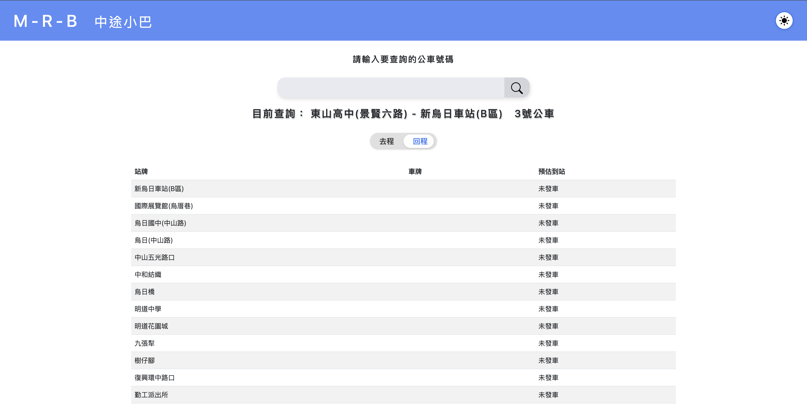
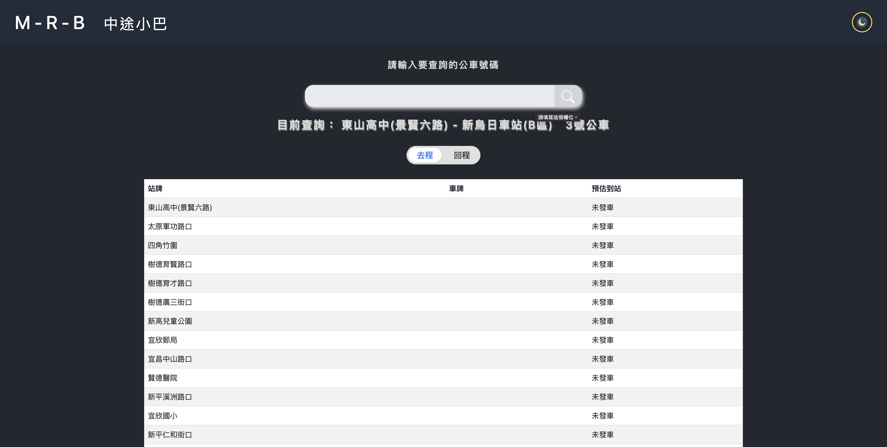

# M-R-B 中途小巴     作者：Eight Lu

嗨！我是專案的作者，這邊是對於此專案的介紹，此專案目的是讓使用著可以查詢「台中市區公車抵達站點時間」的小網站。
而網站中所有公車的資訊都是透過由「運輸資料流通服務平臺（TDX）」的 Open API 所獲取，所以資訊都是正確、公開、合法的，請不用擔心！

## 專案簡介
本專案是一個以 Django 開發的台中市區公車即時動態查詢網站，整合 TDX API，提供友善的公車到站查詢、去回程切換、日夜模式、響應式設計，並支援雲端自動部署。

## 主要功能
- 即時查詢台中市區公車到站資訊（整合 TDX API）
- 有去程/回程滑動切換顯示
- 響應式 UI，手機/電腦自動調適畫面排版
- 日夜模式切換

## 專案畫面
- 
- 

## 技術棧
- Python 3.11+
- Django 5+
- Gunicorn
- Whitenoise
- TDX API
- Render 雲端平台

## 專案結構
```
MRB/
├── bus_project/         # Django 主設定
├── businfo/             # 公車查詢 app
├── static/              # 靜態檔案與圖示
├── templates/           # 前端模板
├── requirements.txt     # 依賴套件
├── runtime.txt          # Python 版本
└── README.md
```

## 授權
如需參考本專案並採用內容請一定要聯繫：williamlu16888@gmail.com 信箱進行詢問以及許可

---

如有問題或建議，歡迎開 issue 或 PR！
